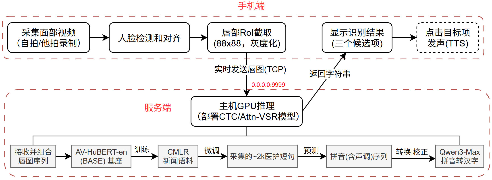

# ReadYourLips
a Chinese medical lip-reading app for assisting people who are unable to speak normally in clinical practice.

### Overall Framework

### Traing model on CMLR
- Use the pre-trained [AV-HuBERT](https://facebookresearch.github.io/av_hubert) encoder as the model backbone.
- Convert the original weights to pytorch version using [this](https://github.com/kyushusouth/avhubert).
- Translate Chinese characters into pinyin using [Hanzi2Pinyin](https://github.com/mozillazg/python-pinyin).
- [Train]: `python avtrain.py 0 train` on the news benchmark CMLR.
- Translate pinyin sequence into Chinese using [QWen3](https://github.com/QwenLM/Qwen3) LLM (online API).

### Fine-tune model on healthcare data
- Collect the healthcare video data by your mobile phone.
- Preprocess the video data into 88x88 gray-scale lip-cropped images.
- [Adapt]:  `python avtrain.py 0 adapt` to continue fine-tuning the pre-trained model in the prior step.

### Start the service
- `python server.py` to start the host-side server (IP address: 0.0.0.0).
- The mobile-side connects to the service by setting the right host IP.
- Record the frontal talking face for recognition.
